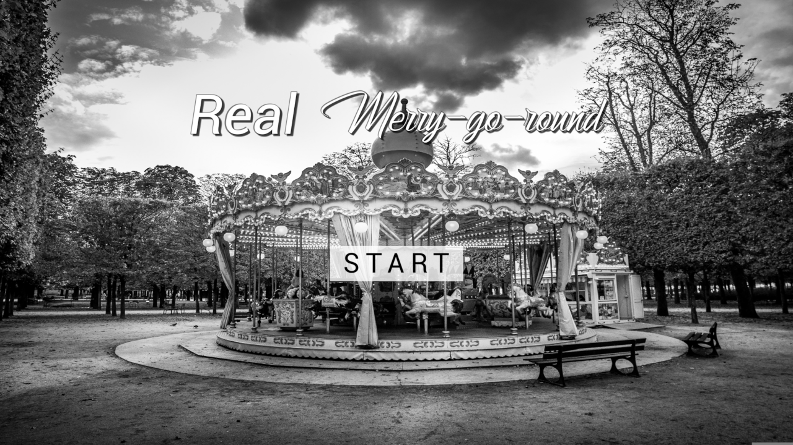

# 大人のメリーゴーランド [[第22回UE5ぷちコン](https://historia.co.jp/ue5petitcon22)]

English version is none. Please use DeepL etc.  

  
メリーゴーランド的要素を入れた、前にいる馬に次々飛び乗りまくるゲームです。  
制限時間内にたくさん飛び乗り、距離を長く稼いでください！  
このゲームはUnreal Engine 5を使って開発しています。  

## 遊び方

Youtube動画は[こちら](https://youtu.be/gkIiaPFpMzc)。  

- マウスクリック  
  矢印に向かって飛び乗りを試す。  
  馬がいる場合、飛び乗りに成功し、得点（距離）が加算される。  
  飛び乗り失敗時は、何も起こらない。  

- Escキー  
  ゲームを終了する。  

## クレジット

### UE Assets
- [Horse Starter Kit](https://www.unrealengine.com/marketplace/en-US/product/horse-starter-kit) by
  [Living Systems](https://www.unrealengine.com/marketplace/en-US/profile/Living+Systems)

### 画像
- [Merry-go-round, Carousel, Paris](https://pixabay.com/photos/merry-go-round-carousel-paris-4965906/) by
  [BertrandFines](https://pixabay.com/users/bertrandfines-12985614/)

### フォント
- [Merry Christmas](https://www.dafont.com/merry-christmas-3.font) by
  [Fajr's Type](https://www.dafont.com/profile.php?user=1084072)

### BGM
- [のびのび散歩道](https://dova-s.jp/bgm/play3897.html) by
  [OK-Sounds](https://dova-s.jp/_contents/author/profile145.html)

### 効果音
- [システム決定音_1](https://dova-s.jp/se/play478.html) by
  [Make a field Music](https://dova-s.jp/_contents/author/profile164.html)
- [和風太鼓の音](https://dova-s.jp/se/play088.html) by
  [もっぴーさうんど](https://dova-s.jp/_contents/author/profile060.html)
- [風切り音（軽）](https://dova-s.jp/se/play1422.html) by
  [稿屋 隆](https://dova-s.jp/_contents/author/profile000.html)
- [Horse footsteps](https://pixabay.com/sound-effects/horse-footsteps-189992/) by
  [Isybeatz](https://pixabay.com/users/isybeatz-34983879/)
